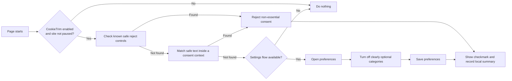

<div align="center">
  
  <h1>CookieTrim</h1>
  <p><strong>Keep only what you need.</strong></p>
  <p>A local-first Chrome extension that automatically chooses <em>Reject all</em> or <em>Necessary only</em> on cookie-consent banners—when it can do so safely.</p>

  [](https://github.com/rinrin583/cookietrim/actions/workflows/test.yml)
  [](https://developer.chrome.com/docs/extensions/reference/manifest)
  [](LICENSE)
  [](PRIVACY.md)

  **English** · [简体中文](README.zh-CN.md)
</div>

---

## The problem

Cookie banners turn one simple preference into the same repetitive task on every website. The privacy-preserving choice is often smaller, hidden behind a settings screen, or expressed differently in every language.

CookieTrim was built for one straightforward preference:

> Keep the cookies a website genuinely needs, and decline the rest whenever there is a reliable way to do so.

It is deliberately conservative. CookieTrim never clicks **Accept all**, never hides an unresolved banner to make it look solved, and never deletes cookies already stored by a website.

## What it does

- Selects **Reject all**, **Necessary only**, or an equivalent safe choice when one is clearly available.
- Handles two-step banners by opening preferences, switching off clearly optional categories, and saving the result.
- Recognizes stable controls used by common consent-management platforms.
- Matches safe action labels in English, German, French, Spanish, Italian, Dutch, Polish, Portuguese, Chinese, Japanese, and Korean.
- Watches dynamically inserted banners for up to 60 seconds after a page opens.
- Searches matching frames and open Shadow DOM roots, not only the top-level document.
- Lets you pause automation globally or for individual domains.
- Shows a short success indicator and keeps a local summary of the 20 most recent actions.
- Runs without telemetry, analytics, advertising, remote code, or an external service.

## Safety model

CookieTrim prefers doing nothing over making the wrong choice.

| Situation | CookieTrim's behavior |
|---|---|
| A known, visible reject control exists | Click it once and stop |
| A clear “necessary only” label appears inside a consent dialog | Click it once and stop |
| Rejection is hidden behind settings | Open settings, disable clearly optional categories, then save |
| A button resembles “Accept all” | Exclude it from every generic action path |
| The banner is ambiguous or unsupported | Leave it visible for manual handling |
| The site is on your allowlist | Do nothing |
| 60 seconds or 8 interactions are reached | Stop scanning the page |

The extension does **not** use CSS to hide consent dialogs. A missing banner should mean a real consent action occurred—not merely that the banner was made invisible.

## How it works



The content script starts at `document_start` in Chrome's isolated world. It first checks narrowly targeted selectors, then falls back to normalized text rules only when a clickable element sits inside a visible cookie/privacy/consent context. A `MutationObserver` handles banners that arrive after the page itself has loaded.

## Privacy and permissions

CookieTrim is intentionally small and local. Its complete runtime is included in this repository.

| Permission | Why it is needed |
|---|---|
| `storage` | Saves your enabled state, site allowlist, display preferences, aggregate counters, and the 20 most recent action summaries in `chrome.storage.local` |
| `activeTab` | Lets the toolbar popup identify the current site's hostname after you open the popup |
| `http://*/*`, `https://*/*` | Allows the content script to find consent controls on ordinary websites |

Notably, CookieTrim requests **no** `cookies`, `webRequest`, `declarativeNetRequest`, `history`, or `tabs` permission. It does not read cookie values, intercept network traffic, or upload browsing data. Chrome documents that `storage.local` is extension-specific local storage and is cleared when the extension is removed; see the [Chrome Storage API](https://developer.chrome.com/docs/extensions/reference/api/storage).

For the full plain-language statement, read [PRIVACY.md](PRIVACY.md).

## Installation

CookieTrim is currently distributed as an unpacked open-source extension; it is not yet published in the Chrome Web Store.

### Option A: clone with Git

```bash
git clone https://github.com/rinrin583/cookietrim.git
```

### Option B: download the source

Download [the latest main-branch ZIP](https://github.com/rinrin583/cookietrim/archive/refs/heads/main.zip) and extract it to a permanent folder.

### Load it in Chrome

1. Open `chrome://extensions/`.
2. Turn on **Developer mode** in the upper-right corner.
3. Click **Load unpacked**.
4. Select the cloned or extracted `cookietrim` folder—the folder containing `manifest.json`.
5. Optionally pin CookieTrim to the toolbar.

When you update the source, return to `chrome://extensions/` and click the extension's **Reload** button.

## Using CookieTrim

CookieTrim starts enabled after installation.

- Open the toolbar popup to pause or resume all automation.
- Use **Pause on this site** when a website needs manual consent handling.
- Open **Advanced settings** to manage wildcard domain exceptions such as `*.example.com`.
- Turn off the success indicator if you prefer completely silent operation.
- Enable debug logging only when diagnosing a rule; logs remain in the browser developer console.

When CookieTrim completes a safe reject/save action, its toolbar badge briefly shows a checkmark.

## Supported behavior

The current rule set includes stable controls associated with platforms and implementations such as OneTrust, Cookiebot, Didomi, CookieYes, Complianz, Osano, Termly, Iubenda, Borlabs, Cookie Script, Shopify, Civic, Amazon, and other standards-based consent dialogs.

Support is best-effort, not a permanent compatibility promise. Consent platforms and individual websites can change their markup without notice. Please report a reproducible public page through the [issue tracker](https://github.com/rinrin583/cookietrim/issues) when a safe action is missed.

## What CookieTrim is not

- **Not a cookie cleaner:** it does not delete existing cookies or sign you out of websites.
- **Not an ad blocker:** it does not block requests, scripts, ads, fingerprinting, or trackers directly.
- **Not a compliance guarantee:** a website can ignore consent or behave incorrectly after a choice is submitted.
- **Not an AI agent:** every action follows auditable selectors and text rules included in the repository.
- **Not universal:** closed Shadow DOM, unusual cross-origin frames, canvas-based interfaces, and highly custom consent flows may require manual action.

## Testing and verification

Requirements: a current Node.js release. The extension itself has no runtime dependencies.

```bash
npm test
```

The automated checks cover:

- 28 multilingual rule assertions.
- Manifest V3 structure and every referenced file.
- JavaScript syntax.
- Matching versions in `manifest.json` and `package.json`.
- A safety guard against direct cookie deletion or rewriting.

The installed extension has also passed three browser smoke scenarios:

1. Direct **Reject all**.
2. Preferences → keep necessary → disable analytics/marketing → save.
3. An accept-only banner remains visible and **Accept all** is not clicked.

See [TEST_REPORT.md](TEST_REPORT.md) for the recorded result. Every push and pull request runs the same checks through GitHub Actions.

## Repository structure

```text
cookietrim/
├── manifest.json          Chrome Manifest V3 configuration
├── rules.js               Selectors and multilingual safety rules
├── content-script.js      Banner detection and interaction engine
├── background.js          Local statistics and toolbar badge
├── popup.*                Quick controls and recent status
├── options.*              Preferences and site allowlist
├── icons/                 Chrome toolbar/store icon sizes
├── assets/brand/          Project logo assets
├── tests/                 Rule and browser-smoke fixtures
└── scripts/validate.cjs   Static manifest and safety validation
```

## Contributing

Contributions are welcome, especially:

- A reproducible public site whose banner is not handled.
- A new language label with a focused test.
- A narrowly scoped selector for a common consent platform.
- Accessibility, documentation, or interface improvements.

Please do not include cookie values, account details, tokens, or private page content in an issue. Read [CONTRIBUTING.md](CONTRIBUTING.md) before submitting code and [SECURITY.md](SECURITY.md) for sensitive reports.

## Frequently asked questions

<details>
<summary><strong>Why does the extension need access to all websites?</strong></summary>

Cookie banners live inside the websites you visit. A content script needs matching site access to see and operate those controls. The requested host patterns cover only HTTP and HTTPS pages; file URLs are not included.
</details>

<details>
<summary><strong>Will it delete my login or shopping-cart cookies?</strong></summary>

No. CookieTrim does not request Chrome's cookie API and does not rewrite `document.cookie`. It interacts with the same visible consent controls you could click manually.
</details>

<details>
<summary><strong>Why did a banner remain on screen?</strong></summary>

CookieTrim could not find a sufficiently reliable reject or necessary-only path. Leaving the banner visible is the intended safe fallback. Please report the public URL and visible labels if you would like support added.
</details>

<details>
<summary><strong>Can I disable it for one website?</strong></summary>

Yes. Open the toolbar popup on that site and choose **Pause on this site**, or add the domain in Advanced settings.
</details>

<details>
<summary><strong>Does it work in other Chromium browsers?</strong></summary>

It may work in Chromium-based browsers that support equivalent Manifest V3 APIs, but the current release and tests target Google Chrome.
</details>

## Roadmap

- Expand tested coverage for widely used consent platforms.
- Add more language-specific regression tests.
- Improve diagnostics for unsupported banners without collecting user data.
- Prepare a reproducible packaged release and store-submission checklist.

Roadmap items are intentions, not delivery promises. See [open issues](https://github.com/rinrin583/cookietrim/issues) for current work.

## License

CookieTrim is released under the [MIT License](LICENSE). © 2026 CookieTrim contributors.

---

<div align="center">
  <strong>CookieTrim</strong> — fewer consent clicks, no pretend fixes.
</div>
