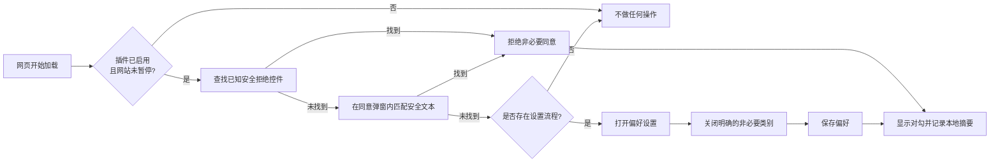

<div align="center">
  
  <h1>CookieTrim｜饼干退退退</h1>
  <p><strong>一个被 Cookie 弹窗逼疯后写出来的插件。</strong></p>
  <p>只留下必要的，其他饼干统统退退退。</p>
  <p>一个本地运行的 Chrome 扩展：在能够安全判断时，自动选择“拒绝全部”或“仅必要”。</p>

  [](https://github.com/rinrin583/cookietrim/actions/workflows/test.yml)
  [](https://developer.chrome.com/docs/extensions/reference/manifest)
  [](LICENSE)
  [](PRIVACY.md)

  [English](README.md) · **简体中文**
</div>

---

## 我为什么写它？

打开一个网站，Cookie 弹窗出现了。

“全部接受”又大又亮；“全部拒绝”藏在角落；有的网站还非要你先进入设置，再逐个关掉分析、广告、营销、个性化……换一个网站，再来一遍。

所以有了 **CookieTrim｜饼干退退退**：

> 网站正常运行需要的 Cookie 可以留下；其余选项，只要存在可靠的拒绝方式，就自动帮我退退退。

它不是一款“假装解决”的插件。如果不能可靠判断，CookieTrim 宁可什么也不做，把横幅留给你手动处理；它不会点击“全部接受”，也不会简单用 CSS 把横幅藏起来。

## 它能做什么？

- 找到明确入口时，自动选择 **拒绝全部**、**仅必要**或含义等价的安全选项。
- 处理两步式弹窗：先进入偏好设置，再关闭明确标注的非必要类别，最后保存。
- 识别多个常见 Cookie 同意管理平台使用的稳定控件。
- 识别英语、德语、法语、西班牙语、意大利语、荷兰语、波兰语、葡萄牙语、中文、日语和韩语的安全操作文本。
- 页面打开后监听动态出现的弹窗，最长 60 秒。
- 不只检查主页面，还会检查匹配的 iframe 和开放的 Shadow DOM。
- 支持全局暂停，以及按网站暂停。
- 成功处理后可显示短暂提示，并在本地记录最近 20 条操作摘要。
- 不含遥测、广告、远程代码、外部服务或浏览数据上传。

## 安全原则

CookieTrim 的第一原则不是“什么都自动点”，而是：**宁可漏掉，也不要误点。**

| 遇到的情况 | CookieTrim 会怎么做 |
|---|---|
| 找到已知且可见的拒绝按钮 | 点击一次，然后停止 |
| 同意弹窗中出现明确的“仅必要”按钮 | 点击一次，然后停止 |
| 拒绝选项藏在设置页面里 | 进入设置、关闭明确的非必要类别、保存 |
| 按钮文字类似“全部接受” | 从所有通用点击路径中排除 |
| 弹窗含义模糊或暂不支持 | 保持原样，留给用户手动处理 |
| 当前网站在例外名单中 | 完全不操作 |
| 已监听 60 秒或执行 8 次交互 | 停止本页面的扫描 |

插件不会用 CSS 把未解决的弹窗隐藏掉。弹窗消失应当意味着完成了一次真实的同意选择，而不是“眼不见为净”。

## 工作原理



内容脚本在 `document_start` 阶段进入 Chrome 的隔离环境。它先检查范围较窄、可靠性较高的已知选择器；没有找到时，才会在可见的 Cookie/隐私/同意语境中匹配规范化后的按钮文字。`MutationObserver` 会继续观察稍后才加载出来的弹窗。

## 隐私与权限

CookieTrim 的完整运行代码都在这个仓库中，不依赖服务器。

| 权限 | 用途 |
|---|---|
| `storage` | 在 `chrome.storage.local` 保存启用状态、网站例外名单、显示设置、累计计数和最近 20 条操作摘要 |
| `activeTab` | 你打开工具栏弹窗后，用于识别当前网站的域名 |
| `http://*/*`、`https://*/*` | 让内容脚本能够在普通网页中寻找 Cookie 同意控件 |

尤其需要说明：CookieTrim **没有**申请 `cookies`、`webRequest`、`declarativeNetRequest`、`history` 或 `tabs` 权限。它不读取 Cookie 值，不拦截网络请求，也不上传浏览记录。Chrome 官方文档说明，`storage.local` 是扩展专用的本地存储，并会在扩展卸载时清除；可参见 [Chrome Storage API](https://developer.chrome.com/docs/extensions/reference/api/storage)。

完整说明见 [PRIVACY.md](PRIVACY.md)。

## 安装方法

CookieTrim 目前以开源、解压加载的方式发布，尚未上架 Chrome 网上应用店。

### 方法一：使用 Git 克隆

```bash
git clone https://github.com/rinrin583/cookietrim.git
```

### 方法二：下载源代码

下载 [main 分支 ZIP](https://github.com/rinrin583/cookietrim/archive/refs/heads/main.zip)，然后解压到一个不会随意移动的文件夹。

### 在 Chrome 中加载

1. 打开 `chrome://extensions/`。
2. 开启右上角的“开发者模式”。
3. 点击“加载已解压的扩展程序”。
4. 选择包含 `manifest.json` 的 `cookietrim` 文件夹。
5. 如果需要，可以把 CookieTrim 固定到浏览器工具栏。

更新源代码后，需要回到 `chrome://extensions/`，点击扩展卡片上的“重新加载”。

## 使用方法

安装后，CookieTrim 默认启用。

- 打开工具栏弹窗，可以暂停或重新开启全部自动处理。
- 遇到需要手动选择的网站，可点击“在此网站暂停”。
- 在“高级设置”中可以管理域名例外名单，例如 `*.example.com`。
- 如果不想看到处理成功提示，可以关闭页面提示。
- 调试日志仅用于排查规则问题，内容只会写入浏览器开发者控制台。

当插件成功完成拒绝或保存操作时，工具栏图标会短暂显示一个对勾。

## 当前支持范围

现有规则包含与 OneTrust、Cookiebot、Didomi、CookieYes、Complianz、Osano、Termly、Iubenda、Borlabs、Cookie Script、Shopify、Civic、Amazon 等平台或实现相关的稳定控件，也支持其他采用标准按钮和同意弹窗结构的网站。

这里的“支持”是尽力而为，不代表永久兼容。Cookie 平台和网站可以随时修改页面结构。如果某个公开网站没有被正确处理，欢迎通过 [Issues](https://github.com/rinrin583/cookietrim/issues) 提供公开网址和可见按钮文字。

## 它不是什么？

- **不是 Cookie 清理器：**不会删除已有 Cookie，也不会把你登出网站。
- **不是广告拦截器：**不会直接阻止请求、脚本、广告、指纹识别或追踪器。
- **不是合规保证：**网站仍可能无视用户选择，或在提交选择后出现不合规行为。
- **不是 AI 自动代理：**所有动作都来自仓库中可审计的选择器和文本规则。
- **不是全能工具：**封闭 Shadow DOM、特殊跨域框架、Canvas 界面或高度定制的流程仍可能需要手动操作。

## 测试与验证

测试需要当前版本的 Node.js；扩展本身没有运行时依赖。

```bash
npm test
```

自动测试包括：

- 28 条多语言规则断言。
- Manifest V3 结构及全部引用文件。
- JavaScript 语法。
- `manifest.json` 与 `package.json` 版本一致性。
- 防止直接删除或改写网站 Cookie 的安全检查。

已安装的 Chrome 扩展还通过了三个浏览器冒烟场景：

1. 直接点击“拒绝全部”。
2. 进入偏好设置 → 保留必要项 → 关闭分析/营销 → 保存。
3. 只有“全部接受”的弹窗保持可见，插件不点击接受。

详细记录见 [TEST_REPORT.md](TEST_REPORT.md)。每次推送和拉取请求也会通过 GitHub Actions 自动运行同一组检查。

## 仓库结构

```text
cookietrim/
├── manifest.json          Chrome Manifest V3 配置
├── rules.js               选择器与多语言安全规则
├── content-script.js      弹窗检测和交互引擎
├── background.js          本地统计与工具栏状态
├── popup.*                快捷控制和最近状态
├── options.*              设置与网站例外名单
├── icons/                 Chrome 图标尺寸
├── assets/brand/          项目品牌资源
├── tests/                 规则测试与浏览器测试夹具
└── scripts/validate.cjs   Manifest 和安全静态检查
```

## 参与贡献

尤其欢迎以下贡献：

- 提供无法正确处理的公开网页和复现步骤。
- 增加新语言按钮文字及对应测试。
- 为常见同意平台增加范围明确的安全选择器。
- 改进无障碍、文档或界面体验。

请勿在公开 Issue 中提交 Cookie 值、账号信息、Token 或私人页面内容。提交代码前请阅读 [CONTRIBUTING.md](CONTRIBUTING.md)；安全敏感问题参见 [SECURITY.md](SECURITY.md)。

## 常见问题

<details>
<summary><strong>为什么需要访问所有网站？</strong></summary>

Cookie 弹窗就在你访问的网页中，内容脚本需要相应的网站访问权限才能找到并操作这些控件。当前范围只包括 HTTP 和 HTTPS 页面，不包括本地文件。
</details>

<details>
<summary><strong>它会删掉登录或购物车 Cookie 吗？</strong></summary>

不会。CookieTrim 没有申请 Chrome 的 Cookie API，也不会改写 `document.cookie`。它操作的是你原本可以手动点击的可见同意控件。
</details>

<details>
<summary><strong>为什么有些 Cookie 弹窗还在？</strong></summary>

因为插件没有找到足够可靠的拒绝或仅必要路径。保留弹窗是预期的安全回退，而不是故障掩盖。你可以提交公开网址和可见按钮文字，帮助增加支持。
</details>

<details>
<summary><strong>可以只在某个网站禁用吗？</strong></summary>

可以。在该网站打开工具栏弹窗，点击“在此网站暂停”；也可以在高级设置中加入域名。
</details>

<details>
<summary><strong>其他 Chromium 浏览器能用吗？</strong></summary>

只要支持相同的 Manifest V3 API，就有可能正常工作；不过目前的正式测试目标是 Google Chrome。
</details>

## 后续计划

- 扩大常见 Cookie 同意平台的实测覆盖。
- 增加更多语言的回归测试。
- 在不收集用户数据的前提下改进失败诊断。
- 准备可复现的打包发布和商店上架清单。

以上是开发方向，不是交付承诺。当前进展以 [Issues](https://github.com/rinrin583/cookietrim/issues) 为准。

## 开源协议

CookieTrim 使用 [MIT License](LICENSE) 开源。© 2026 CookieTrim contributors.

---

<div align="center">
  <strong>CookieTrim｜饼干退退退</strong><br>
  少点几次同意，别再假装解决。
</div>
