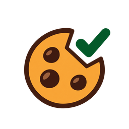

<div align="center">
  
  <h1>CookieTrim｜饼干退退退</h1>
  <p><strong>一个被 Cookie 弹窗逼疯后写出来的插件。</strong></p>
  <p>只留下必要的，其他饼干统统退退退。</p>
  <p>一个本地运行的 Chrome 扩展，自动在 Cookie 同意横幅中选择“拒绝全部”或“仅必要”。</p>
</div>

## 为什么叫 CookieTrim？

它不是彻底禁用 Cookie，而是把不必要的同意选项“修剪掉”。因此名称比 `No Cookie` 更准确，也不会与已有的 `I Don't Care About Cookies` 项目混淆。

中文昵称叫 **“饼干退退退”**：既保留了对烦人弹窗的真实情绪，也没有假装扩展会删除所有 Cookie。正式技术名用于 GitHub 和代码，中文昵称用于界面与社交平台传播。

## 主要功能

- 有可靠入口时，优先选择“拒绝全部”或“仅必要”。
- 支持两步流程：进入偏好设置、关闭明确标注的广告/分析/营销类别，再保存。
- 覆盖常见 CMP，并识别 11 种语言的安全拒绝文本。
- 处理动态页面、开放 Shadow DOM 和匹配的 iframe。
- 可暂停当前网站，并在本地保存最近操作摘要。
- 不含遥测、分析、远程代码或外部网络请求。
- 无法可靠判断时保留横幅，绝不自动点击“接受全部”。

## 本地安装

1. 下载或克隆本仓库。
2. 在 Chrome 打开 `chrome://extensions/`。
3. 开启“开发者模式”。
4. 点击“加载已解压的扩展程序”，选择仓库文件夹。
5. 可将 CookieTrim 固定到工具栏，方便查看状态或暂停当前网站。

扩展需要访问 HTTP/HTTPS 页面，因为 Cookie 横幅本身就在网页中。详细说明见 [隐私政策](PRIVACY.md)。

## 测试

```powershell
npm test
```

测试覆盖多语言匹配、Manifest V3 结构、引用文件、JavaScript 语法，以及“不直接删除或重写网站 Cookie”的安全约束。

## 已知边界

- 网站随时可能修改横幅结构，无法保证覆盖 100% 的网站。
- 扩展不对现有 Cookie 做可靠分类，也不会批量删除它们。
- 不会用 CSS 隐藏未处理成功的横幅。
- 它是减少重复操作的便利工具，不构成合规或完全阻止追踪的保证。

## 开源协议

[MIT](LICENSE) © 2026 CookieTrim contributors.
